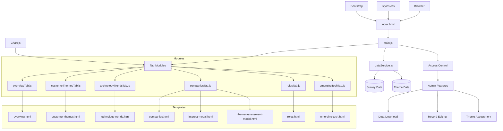
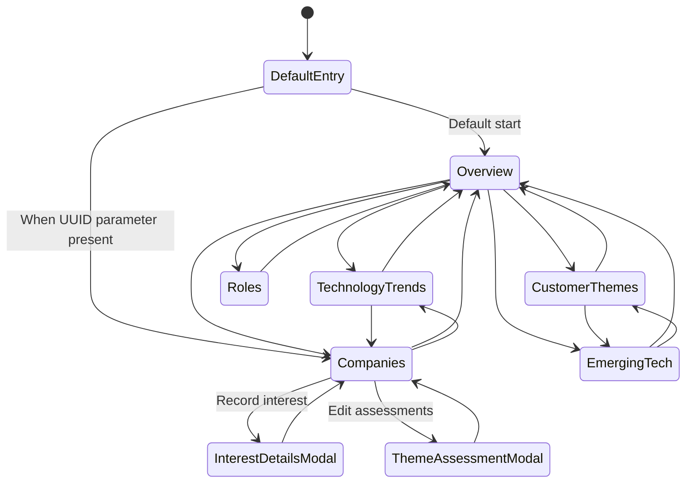

# Brightspots & Whitespots Dashboard Architecture

## Executive Summary

The Brightspots & Whitespots Dashboard is a Single Page Application (SPA) designed to visualize and explore survey data related to business challenges, technology trends, and product vendors. The application allows users to identify "bright spots" (successful areas) and "white spots" (opportunity areas) in the technology and business landscape.

The application follows a modular, component-based architecture with a clear separation of concerns. It uses vanilla JavaScript with ES6 modules, Bootstrap for UI components, and Chart.js for data visualization. The application is designed as a client-side only web application with no backend dependencies, loading data from JSON files that can be either local or remote.

Key architectural features include:
- Flexible data source configuration via URL parameters
- Role-based access control through admin mode and company-specific editing
- Modular tab-based interface with dynamic content loading
- Client-side data manipulation and storage
- Theme-based assessment system for company technology positioning

## Technology Stack

### Frontend
- **HTML5/CSS3**: Core web technologies for structure and styling
- **JavaScript (ES6+)**: Modern JavaScript with module system
- **Bootstrap 5**: UI framework providing responsive design and components
- **Chart.js**: Data visualization library for interactive charts
- **Fetch API**: For loading data and HTML templates

### Data Management
- **JSON**: Data storage format
- **ES6 Modules**: For code organization and encapsulation
- **Local Storage/Session Storage**: For temporary state management between tab navigation

### Build & Deployment
- **Static File Hosting**: No build process required, plain HTML/CSS/JS
- **HTTP Server**: Any basic web server capable of serving static files

## Component Architecture



### Core Components

1. **index.html**: Main entry point containing the tab structure and container elements
2. **main.js**: Application initialization, tab navigation handling, and admin functionality
3. **dataService.js**: Centralized data management module that loads and processes survey data
4. **Tab Modules**: Separate modules for each tab's functionality (overview, customer themes, etc.)
5. **HTML Templates**: HTML fragments loaded dynamically for each tab
6. **Modal Components**: Dialog interfaces for detailed data entry and editing
7. **Chart.js Integration**: Data visualization within each relevant tab

### Feature Components

1. **Data Service Capabilities**:
   - Survey data loading and processing
   - Theme data management
   - Assessment data storage and retrieval
   - Interest details tracking
   - Record lookup by ID

2. **Admin Mode Features**:
   - Download button for exporting modified dataset
   - Record editing capabilities
   - Theme assessment management

3. **Companies Tab Enhanced Features**:
   - Company details view with interest levels
   - Interest recording for challenges, tech concepts, and products
   - Theme assessment via collapsible panel and modal editor
   - Company-specific editing when in UUID mode

## Data Flow

The application manages several types of data:

1. **Survey Data**: The core dataset loaded from JSON files
2. **Theme Data**: Main themes for technology assessment categorization
3. **Assessment Data**: User-provided evaluations of company themes and interests
4. **UI State**: Temporary state for navigation and user interactions

### Data Loading Process

1. The application initializes by loading survey data through the `dataService.js` module
2. Data can be loaded from either:
   - Local file: `data/brightspots.json` (default)
   - Remote URL: Specified via the `parDataFile` query parameter
3. The application supports two data formats:
   - Legacy format: A simple array of survey records
   - Enhanced format: An object with `surveyData` and `themeAssessments` properties
4. The application checks for specialized modes:
   - Admin mode: Activated via `adminMode=yes` parameter for full editing capabilities
   - UUID mode: Activated via `uuid=[id]` parameter for company-specific editing
5. The loaded data is stored in memory within the `dataService.js` module
6. Theme data is loaded from `data/main-themes.json` when required
7. Each tab module requests specific data from the data service when activated
8. If in UUID mode, the application automatically navigates to the Companies tab and selects the company associated with that record ID

### State Management

1. **Tab State**: Maintained through Bootstrap's tab system
2. **Selection State**: Items selected in one tab can affect other tabs via `sessionStorage`
3. **Chart State**: Charts are initialized once per session and then updated as needed
4. **Interest Details**: User input about interest in specific topics is stored in memory
5. **Theme Assessments**: Company-specific evaluations of technology themes
6. **Access Control State**: Managed through URL parameters
   - Global edit permissions via `adminMode=yes`
   - Company-specific edit permissions via `uuid=[id]`
   - Permission state determines UI element visibility and interactivity

### Data Persistence

1. **Session-Based**: UI state is stored in `sessionStorage` for the current browser session
2. **In-Memory**: All data modifications are held in memory during the session
3. **Data Export**: Modified data can be downloaded as JSON when in admin mode
4. **No Server-Side Storage**: Changes are not persisted to a server automatically

## External Dependencies

| Dependency | Version | Purpose | Type | License |
|------------|---------|---------|------|---------|
| Bootstrap | 5.3.0-alpha1 | UI framework and responsive layout | Frontend | MIT |
| Bootstrap Icons | 1.10.0 | Icon set for UI elements | Frontend | MIT |
| Chart.js | Latest | Data visualization and charts | Frontend | MIT |

### CDN Resources
- Bootstrap CSS: `https://cdn.jsdelivr.net/npm/bootstrap@5.3.0-alpha1/dist/css/bootstrap.min.css`
- Bootstrap Icons: `https://cdn.jsdelivr.net/npm/bootstrap-icons@1.10.0/font/bootstrap-icons.css`
- Bootstrap JS: `https://cdn.jsdelivr.net/npm/bootstrap@5.3.0-alpha1/dist/js/bootstrap.bundle.min.js`
- Chart.js: `https://cdn.jsdelivr.net/npm/chart.js`

## Deployment Architecture

The application is designed as a static web application with no server-side dependencies, making it extremely simple to deploy.

### Deployment Options

1. **Static Web Hosting**:
   - GitHub Pages
   - Netlify
   - Amazon S3
   - Any basic web server

2. **Deployment Process**:
   - No build step required
   - Simply copy the files to the hosting environment
   - Ensure CORS headers are properly set if accessing external data sources

3. **Configuration**:
   - Application can be configured to use different data sources via URL parameters
   - Role-based access is controlled through URL parameters
   - No environment-specific configuration files needed

### Runtime Configuration

The application can be configured at runtime through URL parameters:

| Parameter | Purpose | Example |
|-----------|---------|--------|
| `parDataFile` | Specify an external data source | `parDataFile=https://example.com/data.json` |
| `adminMode` | Enable admin features (editing, download) | `adminMode=yes` |
| `uuid` | Access specific company in edit mode | `uuid=46` |

Parameters can be combined to create different application modes, such as:
```
http://example.com/index.html?parDataFile=https://data.example.com/survey.json&adminMode=yes
```

This configuration flexibility allows the same deployment to serve multiple use cases without code changes.

## Navigation & User Experience

The application uses a tab-based navigation structure to organize content into logical sections, with modal dialogs for detailed interactions.



### Navigation Flow

1. Application Entry Points:
   - The application starts on the Overview tab by default
   - If a UUID parameter is present in the URL, the application automatically navigates to the Companies tab and selects the corresponding company

2. Primary Navigation:
   - Users can navigate to any tab directly from the navigation bar
   - Each tab presents a different view of the survey data

3. Contextual Navigation:
   - Tags in the Customer Themes tab can link to related content in other tabs
   - Company selections can filter content across tabs
   - Direct links with UUID parameters can provide focused access to specific company data

4. Modal Interfaces:
   - Interest details are recorded/viewed through a modal dialog
   - Theme assessments can be edited through a dedicated modal

### Interactive Elements

1. **Data Visualization**:
   - Interactive charts with hover tooltips showing detailed information
   - Color-coded badges for interest levels and assessment categories

2. **Data Filtering**:
   - Content can be filtered by tags, companies, or other attributes
   - Dropdown selectors for major entities (companies, themes)

3. **UI Organization**:
   - Collapsible panels for managing screen real estate
   - Tab-based content separation for focused viewing
   - Modal dialogs for detailed data entry without page navigation

4. **Edit Controls**:
   - Admin-mode controls for global data editing
   - UUID-mode controls for company-specific editing
   - Assessment indicators showing evaluated themes

5. **Responsive Design**:
   - UI adapts to different screen sizes
   - Tables become scrollable on small screens

## Security Considerations

As a client-side only application with no authentication or private data, security concerns are minimal. However, some considerations include:

1. **Data Source Security**:
   - When using external data sources via the `parDataFile` parameter, ensure they are from trusted sources
   - CORS policies must be properly configured on external data sources

2. **Content Security**:
   - The application does not execute any code from the loaded data
   - Chart.js and Bootstrap are loaded from trusted CDNs

3. **Access Control**:
   - The `adminMode` parameter provides unrestricted editing capabilities
   - The `uuid` parameter restricts editing to a specific company
   - These are convenience features, not security boundaries
   - No sensitive operations require authentication

4. **Data Privacy**:
   - All data manipulation happens client-side
   - No automatic data transmission to external servers
   - Downloaded data should be handled according to appropriate data privacy policies

## Scalability & Performance

### Performance Considerations

1. **Data Loading**: 
   - Survey data is loaded once at application startup
   - Theme data is loaded only when needed for assessments

2. **Lazy Loading**:
   - Tab content is loaded only when a tab is activated
   - Charts are initialized only when they become visible
   - Modals are loaded on-demand

3. **Memory Management**:
   - Chart instances are destroyed and recreated to prevent memory leaks
   - Data processing is done once per dataset and then cached
   - Event listeners are properly managed to prevent memory leaks

4. **Content Optimization**:
   - Collapsible panels reduce the visible DOM elements
   - Theme assessments use a compact table view in read-only mode
   - Edit functionality is moved to modals to simplify the main view

### Scalability Factors

1. **Data Size Limitations**:
   - The application is designed for datasets of hundreds to thousands of records
   - Very large datasets (tens of thousands of records) may impact performance
   - No pagination is implemented for large data sets

2. **Browser Limitations**:
   - All data is held in memory, limited by browser memory constraints
   - Complex visualizations may impact performance on low-end devices

### Scalability Limits

1. **Data Volume**:
   - As a client-side application, performance may degrade with very large datasets
   - Recommended limit is a few thousand survey entries for optimal performance

2. **Browser Compatibility**:
   - Supports all modern browsers
   - Requires ES6 module support
