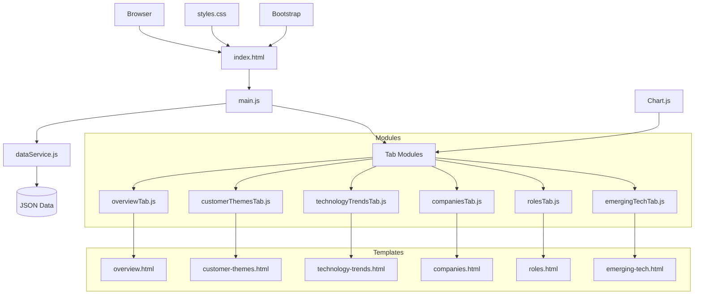
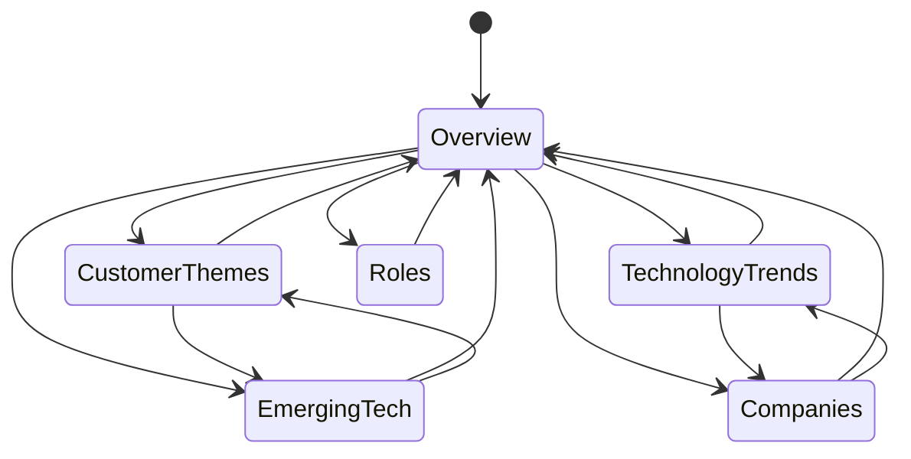

# Brightspots & Whitespots Dashboard Architecture

## Executive Summary

The Brightspots & Whitespots Dashboard is a Single Page Application (SPA) designed to visualize and explore survey data related to business challenges, technology trends, and product vendors. The application allows users to identify "bright spots" (successful areas) and "white spots" (opportunity areas) in the technology and business landscape.

The application follows a modular, component-based architecture with a clear separation of concerns. It uses vanilla JavaScript with ES6 modules, Bootstrap for UI components, and Chart.js for data visualization. The application is designed as a client-side only web application with no backend dependencies, loading data from JSON files that can be either local or remote.

## Technology Stack

### Frontend
- **HTML5/CSS3**: Core web technologies for structure and styling
- **JavaScript (ES6+)**: Modern JavaScript with module system
- **Bootstrap 5**: UI framework providing responsive design and components
- **Chart.js**: Data visualization library for interactive charts
- **Fetch API**: For loading data and HTML templates

### Data Management
- **JSON**: Data storage format
- **ES6 Modules**: For code organization and encapsulation
- **Local Storage/Session Storage**: For temporary state management between tab navigation

### Build & Deployment
- **Static File Hosting**: No build process required, plain HTML/CSS/JS
- **HTTP Server**: Any basic web server capable of serving static files

## Component Architecture

### Core Components

1. **index.html**: Main entry point containing the tab structure and container elements
2. **main.js**: Application initialization and tab navigation handling
3. **dataService.js**: Centralized data management module that loads and processes survey data
4. **Tab Modules**: Separate modules for each tab's functionality (overview, customer themes, etc.)
5. **HTML Templates**: HTML fragments loaded dynamically for each tab
6. **Chart.js Integration**: Data visualization within each relevant tab

## Data Flow

The application manages two primary types of data:

1. **Survey Data**: The core dataset loaded from JSON files
2. **UI State**: Temporary state for navigation and user interactions

### Data Loading Process

1. The application initializes by loading survey data through the `dataService.js` module
2. Data can be loaded from either:
   - Local file: `data/brightspots.json` (default)
   - Remote URL: Specified via the `parDataFile` query parameter
3. The loaded data is stored in memory within the `dataService.js` module
4. Each tab module requests specific data from the data service when activated

### State Management

1. **Tab State**: Maintained through Bootstrap's tab system
2. **Selection State**: Items selected in one tab can affect other tabs via `sessionStorage`
3. **Chart State**: Charts are initialized once per session and then updated as needed
4. **Interest Details**: User input about interest in specific topics is stored in memory

## External Dependencies

| Dependency | Version | Purpose | Type | License |
|------------|---------|---------|------|---------|
| Bootstrap | 5.3.0-alpha1 | UI framework and responsive layout | Frontend | MIT |
| Bootstrap Icons | 1.10.0 | Icon set for UI elements | Frontend | MIT |
| Chart.js | Latest | Data visualization and charts | Frontend | MIT |

### CDN Resources
- Bootstrap CSS: `https://cdn.jsdelivr.net/npm/bootstrap@5.3.0-alpha1/dist/css/bootstrap.min.css`
- Bootstrap Icons: `https://cdn.jsdelivr.net/npm/bootstrap-icons@1.10.0/font/bootstrap-icons.css`
- Bootstrap JS: `https://cdn.jsdelivr.net/npm/bootstrap@5.3.0-alpha1/dist/js/bootstrap.bundle.min.js`
- Chart.js: `https://cdn.jsdelivr.net/npm/chart.js`

## Deployment Architecture

The application is designed as a static web application with no server-side dependencies, making it extremely simple to deploy.

### Deployment Options

1. **Static Web Hosting**:
   - GitHub Pages
   - Netlify
   - Amazon S3
   - Any basic web server

2. **Deployment Process**:
   - No build step required
   - Simply copy the files to the hosting environment
   - Ensure CORS headers are properly set if accessing external data sources

3. **Configuration**:
   - Application can be configured to use different data sources via URL parameters
   - No environment-specific configuration files needed

## Navigation & User Experience

The application uses a tab-based navigation structure to organize content into logical sections.

### Navigation Flow

1. The application starts on the Overview tab
2. Users can navigate to any tab directly from the navigation bar
3. Some tabs contain links that can navigate to other tabs with specific context:
   - Tags in the Customer Themes tab can link to related content in other tabs
   - Company selections can filter content across tabs

### Interactive Elements

1. **Charts**: Interactive charts with hover tooltips showing detailed information
2. **Filters**: Content can be filtered by tags, companies, or other attributes
3. **Collapsible Panels**: Sections can be expanded or collapsed for better information organization
4. **Responsive Design**: UI adapts to different screen sizes

## Security Considerations

As a client-side only application with no authentication or private data, security concerns are minimal. However, some considerations include:

1. **Data Source Security**:
   - When using external data sources via the `parDataFile` parameter, ensure they are from trusted sources
   - CORS policies must be properly configured on external data sources

2. **Content Security**:
   - The application does not execute any code from the loaded data
   - Chart.js and Bootstrap are loaded from trusted CDNs

## Scalability & Performance

### Performance Considerations

1. **Data Loading**: Survey data is loaded once at application startup
2. **Lazy Loading**:
   - Tab content is loaded only when a tab is activated
   - Charts are initialized only when they become visible

3. **Memory Management**:
   - Chart instances are destroyed and recreated to prevent memory leaks
   - Data processing is done once per dataset and then cached

### Scalability Limits

1. **Data Volume**:
   - As a client-side application, performance may degrade with very large datasets
   - Recommended limit is a few thousand survey entries for optimal performance

2. **Browser Compatibility**:
   - Supports all modern browsers
   - Requires ES6 module support
