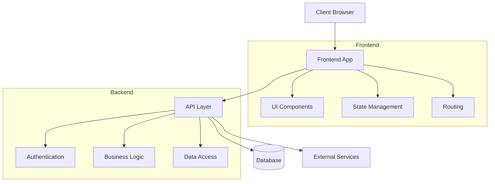
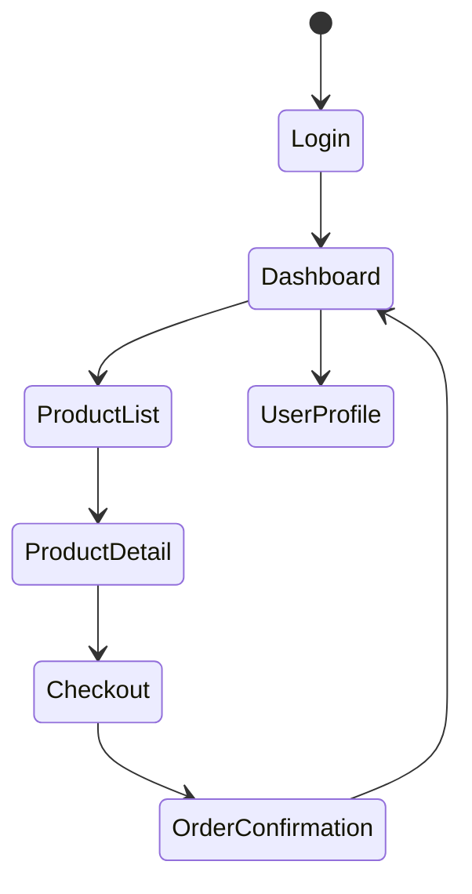

# Guide for LLMs: Creating Web Application Architecture Documentation

This document provides guidelines for LLMs to generate comprehensive architecture documentation for web applications. Follow these instructions to create clear, useful documentation that helps developers understand the structure, components, and dependencies of a web application.

## Document Structure

Structure your architecture documentation with the following sections:

1. **Executive Summary** - Brief overview of the application purpose and key architectural decisions
2. **Technology Stack** - Core technologies and frameworks used
3. **Component Architecture** - Breakdown of application components and their relationships
4. **Data Flow** - What data and state is managed in the application and How does data move through the system
5. **External Dependencies** - Third-party libraries and services
6. **Deployment Architecture** - How the application is deployed and hosted
7. **Navigation & User Experience** - How users navigate through the application
8. **Security Considerations** - Key security features and considerations
9. **Scalability & Performance** - How the architecture handles growth and performance demands

## Creating the Visual Component Overview

Use Mermaid diagrams to visualize the application architecture. Here's an example format:

Guidelines for creating architecture diagrams:

1. Use a top-down approach, starting with high-level components
2. Group related components in subgraphs
3. Use clear, descriptive labels
4. Show key data flows with arrows
5. Use different shapes to distinguish between component types:
   - Rectangles `[]` for application components
   - Cylinders `[()]` for data stores
   - Stadiums `([])` for external services
   - Circles `(())` for user interfaces

## Documenting External Dependencies

Create a comprehensive table of all external dependencies:

| Dependency | Version | Purpose | Type | License |
|------------|---------|---------|------|---------|
| React | 18.2.0 | UI framework | Frontend | MIT |
| Express | 4.18.2 | Web server | Backend | MIT |
| MongoDB | 6.0 | Database | Data store | SSPL |
| Auth0 | N/A | Authentication | Service | Commercial |

For each dependency, answer:

1. Why was this dependency chosen?
2. What specific features/functions does it provide?
3. Are there any known limitations or issues?
4. Are there alternative dependencies that could be used instead?

## Technology Stack Description

Organize technologies by layer:

### Frontend
- **Framework**: (e.g., React, Vue, Angular)
- **State Management**: (e.g., Redux, Vuex, Context API)
- **UI Components**: (e.g., Material UI, Bootstrap)
- **Build Tools**: (e.g., Webpack, Vite)
- **Testing Libraries**: (e.g., Jest, React Testing Library)

### Backend
- **Language**: (e.g., Node.js, Python, Java)
- **Framework**: (e.g., Express, Django, Spring Boot)
- **API Style**: (e.g., REST, GraphQL)
- **Authentication**: (e.g., JWT, OAuth)

### Data Layer
- **Database**: (e.g., PostgreSQL, MongoDB, MySQL)
- **ORM/ODM**: (e.g., Sequelize, Mongoose)
- **Caching**: (e.g., Redis, Memcached)

### DevOps
- **Hosting**: (e.g., AWS, GCP, Azure)
- **CI/CD**: (e.g., GitHub Actions, Jenkins)
- **Containerization**: (e.g., Docker, Kubernetes)
- **Monitoring**: (e.g., Prometheus, Grafana)

## Navigation & User Experience

Describe the application's navigation with:

1. A hierarchical sitemap showing main pages and sub-pages
2. Descriptions of key user flows through the application
3. A diagram showing how navigation states change (use Mermaid state diagrams)

## External Runtime Dependencies

Document all external services and APIs the application depends on:

| Service | Purpose | Authentication Method | Failover Strategy |
|---------|---------|------------------------|-------------------|
| Payment Gateway | Process payments | API Key | Retry with exponential backoff |
| Email Service | Send notifications | OAuth 2.0 | Queue locally and retry |
| Weather API | Display weather data | API Key | Graceful degradation |

For each dependency, describe:

1. What happens if the service is unavailable
2. Rate limits and quotas
3. SLAs and expected performance
4. Required configuration parameters

## Implementation Guidance

When generating the architecture document:

1. **Be specific**: Avoid generic descriptions. Name specific technologies, patterns and components.
2. **Provide rationales**: Explain why architectural decisions were made.
3. **Consider tradeoffs**: Discuss pros and cons of key architectural choices.
4. **Use consistent terminology**: Define terms and use them consistently.
5. **Focus on relationships**: Emphasize how components interact, not just what they are.
6. **Address non-functional requirements**: Security, scalability, performance, accessibility.
7. **Be visual**: Use diagrams to complement textual descriptions.
8. **Consider the audience**: Technical depth should match the intended readers.

## Example Applications

When creating architecture documents, you can reference common architectural patterns:

- Single Page Application (SPA) with REST API
- Microservices architecture
- Serverless architecture
- Monolithic application
- Progressive Web Application (PWA)
- Jamstack architecture

## Helpful Questions to Address

- How does the application handle authentication and authorization?
- What is the strategy for state management?
- How is routing implemented?
- What is the error handling strategy?
- How does the application handle offline scenarios?
- What monitoring and logging solutions are implemented?
- How is configuration managed across environments?
- What testing strategies are employed?

Remember that a good architecture document focuses on helping developers understand both the "what" and the "why" of the system design, enabling them to make consistent decisions when extending or maintaining the application.
